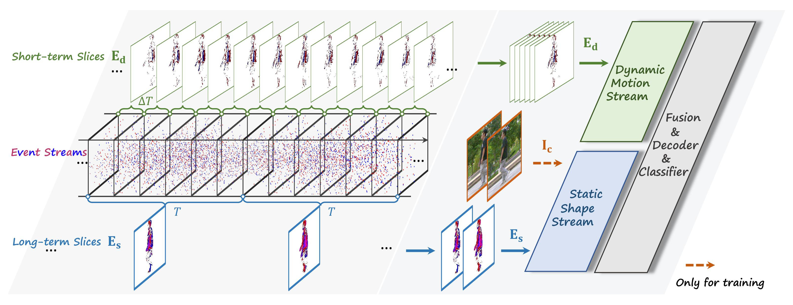

<div align="center">

<h1>[⭐CVPR 2026⭐] EventGait: Towards Robust Gait Recognition with Event Streams</h1>

**Senyan Xu**<sup>1*</sup> &ensp; 
**Shuai Chen**<sup>1*</sup> &ensp; 
**Chuanfu Shen**<sup>2*</sup> &ensp; 
**Kean Liu**<sup>1</sup> &ensp; 
**Zhijing Sun**<sup>1</sup> &ensp; 
**Chengzhi Cao**<sup>1</sup> &ensp; 
**Xueyang Fu**<sup>1✉</sup>

<sup>1</sup>University of Science and Technology of China &ensp; 
<sup>2</sup>University of Electronic Science and Technology of China <br>

<sup>*</sup>Equal Contribution &ensp; 
<sup>✉</sup>Corresponding Author

<br>



</div>

## Abstract
> Gait recognition enables non-intrusive, privacy-preserving identification but suffers in uncontrolled environments due to illumination and motion sensitivity in conventional cameras. In this work, we explore gait recognition using event cameras, which offer microsecond temporal resolution and high dynamic range, naturally capturing robust dynamic cues and suppressing static noise. Existing event-based approaches typically aggregate event streams into event images over long time windows, thereby discarding fine-grained motion dynamics critical for gait recognition. Therefore, we propose **EventGait**, an end-to-end dual-stream framework that separately models motion and shape while preserving the advantages of events. Our dynamic stream leverages a **Mixture of Spiking Experts (MoSE)** with diverse neuron constants for robust dynamic perception across complex motion and illumination scenes, while the static stream learns dense shape representations via **Cross-modal Structural Alignment (CroSA)** with large vision foundation models. To address the absence of large-scale event-based gait datasets, we introduce a synthesis pipeline and release two new benchmarks: SUSTech1K-E and CCGR-Mini-E. Extensive experiments have shown that event-based gait recognition not only achieves results comparable to camera-based gait recognition under normal conditions but also significantly outperforms it in low-light scenarios. Our approach sets a new state of the art on both synthesized and real-world event-based gait benchmarks, highlighting the robustness and potential of event-driven gait analysis. The code and datasets will be released.

## Updates
- [May 3, 2026] 🚀 Code release. The datasets will be coming soon.

## Dependencies and Installation

```
# create new anaconda env
conda create -n eventgait python=3.10
conda activate eventgait

# install
pip install -r requirements.txt
```

## Datasets

We evaluate our method on two newly proposed event-based gait benchmarks: **SUSTech1K-E** and **CCGR-Mini-E**. 

*The datasets and corresponding preprocessing scripts are currently being organized and will be released publically soon. Please stay tuned for the download links!😊*


## Training

Before training, please ensure that the environment is properly configured and the datasets are placed at the paths specified in your chosen configuration file (e.g., `./configs/EventGait/eventgait_L_sustech1k.yaml`). 

To train the model on 8 GPUs, run the following command:

```bash
CUDA_VISIBLE_DEVICES=0,1,2,3,4,5,6,7 python -m torch.distributed.launch --nproc_per_node=8 opengait/main.py --cfgs ./configs/EventGait/eventgait_L_sustech1k.yaml --phase train
```

*Note: A complete training process on SUSTech-1K-E takes approximately 2 days using 8 × RTX 3090 (24GB) GPUs.*


<!-- ## Citation
If you find this work or our datasets useful in your research, please consider citing:

```bibtex
@inproceedings{xu2026eventgait,
  title={{EventGait}: Towards Robust Gait Recognition with Event Streams},
  author={Xu, Senyan and Chen, Shuai and Shen, Chuanfu and Liu, Kean and Sun, Zhijing and Cao, Chengzhi and Fu, Xueyang},
  booktitle={Proceedings of the IEEE/CVF Conference on Computer Vision and Pattern Recognition (CVPR)},
  year={2026}
}
``` -->